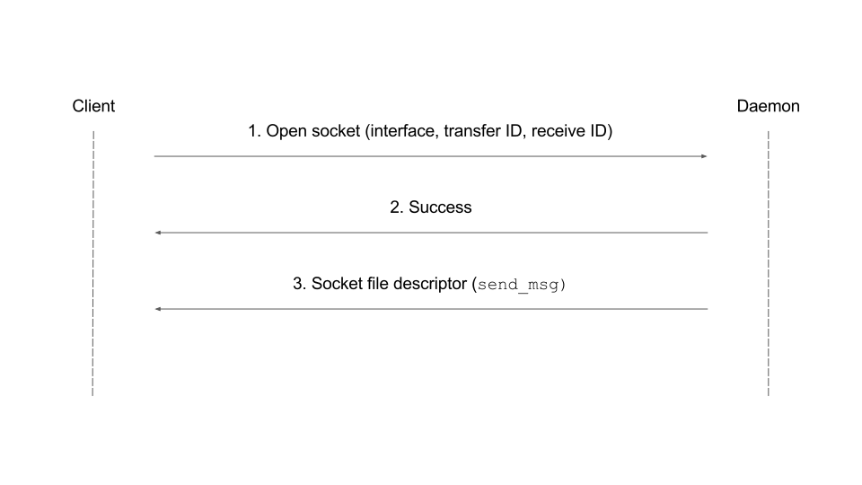
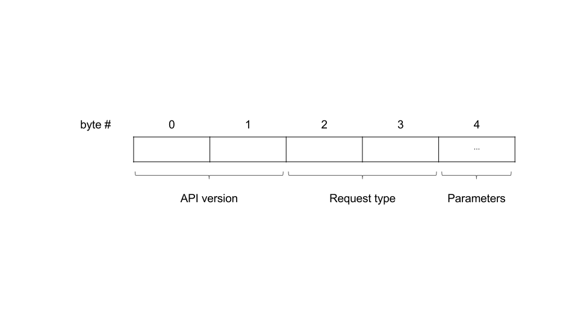
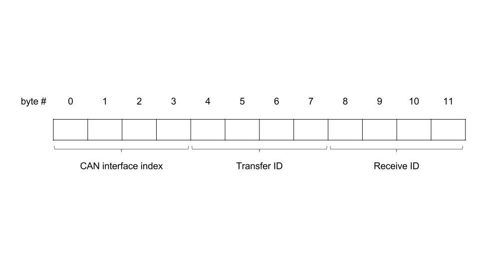

# Overview

As explained in the project [readme](../README.md), the purpose of the daemon is to allow multiple client programs to open an `OBDIISocket` to the same (interface, transfer ID, receive ID) tuple simultaneously. Clients send a request to the daemon to open a socket on their behalf, and then the daemon sends back the socket's file descriptor, which a client can use directly. Importantly, clients must obtain exclusive access to the socket before performing any reads and writes via a call to `flock`. This is done automatically by the `OBDIIPerformQuery` API.

Clients communicate with the daemon using a Unix domain datagram socket, which is listening for requests at `/tmp/obdiid.sock`. See the (protocol)(#protocol) section for the request/response format.

## Sequence diagram

## Protocol

All multi-byte fields are in little endian order.

### Request

A request has the following format:

Currently, the only supported value for `API version` is `1`.

Supported request types:

| Name         | Value |
|:------------:|:-----:|
| Open Socket  | 0     |
| Close Socket | 1     |

For both the `Open Socket` and `Close Socket` request types, the parameters are as follows:

The `CAN interface index` parameter is the interface's index number as returned by a call to `if_nametoindex`.

### Response

The response is a two-byte unsigned integer, representing a response code. Possible values are listed below.

| Code | Name              | Description |
|:----:|:-----------------:|:-----------:|
| 0    | Success           | The request succeeded |
| 1    | No Such Socket    | A request was sent to close a socket, but no socket with the given parameters was open |
| 2    | Open Socket Error | Opening the socket failed (possible if the interface does not exist) |
